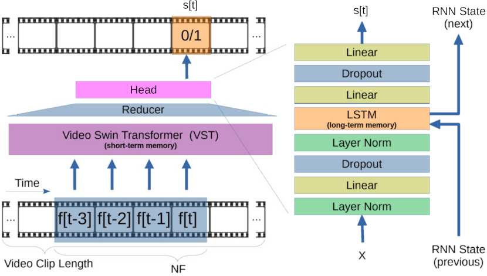

## Incident Detection in Traffic Video
We propose **MOVAD** architecture for online (frame-level) video
anomaly detection.



Authors: Ashutosh Naik

Department of Electronics and Electrical Communication Engineering

Indian Institute of Technology Kharagpur

## Abstract

The advent of Autonomous Vehicles (AVs) has underscored the critical need for robust incident detection systems to ensure the safety and efficiency of road transportation. This report introduces a novel real-time incident detection system, named RTID, designed to operate in an online fashion, providing immediate responses to anomalies detected in the vicinity of AVs. The system relies solely on video data captured by a dashboard-mounted camera, making it a cost-effective and practical solution for widespread implementation.

The core architecture of RTID, comprising two key modules, leverages a Short-Term Memory Module and a Long-Term Memory Module. The former, implemented through a Video Swin Transformer (VST), focuses on extracting information related to ongoing actions by processing RGB frames. Meanwhile, the latter integrates a Long-Short Term Memory (LSTM) network into the classifier, allowing for the consideration of remote past information and action context. The modular design of RTID contributes to its ease of implementation and adaptability, facilitating experimentation and customization.

The strengths of RTID extend beyond its exceptional performance, encompassing its straightforward architecture and end-to-end training methodology with minimal assumptions. These features not only contribute to its ease of implementation but also position RTID as a versatile tool for addressing diverse real-world scenarios. The report concludes with the affirmation that RTID represents a significant advancement in incident detection technology, holding great promise for enhancing the safety and reliability of autonomous and conventional vehicular systems alike.

## Usage

### Installation

```bash
$ git clone https://github.com/IMPLabUniPr/movad/tree/movad_vad
$ cd movad
$ wget https://github.com/SwinTransformer/storage/releases/download/v1.0.4/swin_base_patch244_window1677_sthv2.pth -O pretrained/swin_base_patch244_window1677_sthv2.pth
$ conda env create -n movad_env --file environment.yml
$ conda activate movad_env
```

# Download DoTa dataset

Please download from [official website](https://github.com/MoonBlvd/Detection-of-Traffic-Anomaly)
the dataset and save inside `data/dota` directory.

You should obtain the following structure:

```
data/dota
├── annotations
│   ├── 0qfbmt4G8Rw_000306.json
│   ├── 0qfbmt4G8Rw_000435.json
│   ├── 0qfbmt4G8Rw_000602.json
│   ...
├── frames
│   ├── 0qfbmt4G8Rw_000072
│   ├── 0qfbmt4G8Rw_000306
│   ├── 0qfbmt4G8Rw_000435
│   .... 
└── metadata
    ├── metadata_train.json
    ├── metadata_val.json
    ├── train_split.txt
    └── val_split.txt
```

# Download pretrained on DoTA dataset

Open [Release v1.0](https://github.com/IMPLabUniPr/movad/releases/tag/v1.0)
page and download .pt (pretrained) and .pkl (results) file.
Unzip them inside the `output` directory, obtaining the following directories
structure:

```
output/
├── v4_1
│   ├── checkpoints
│   │   └── model-640.pt
│   └── eval
│       └── results-640.pkl
└── v4_2
    ├── checkpoints
    │   └── model-690.pt
    └── eval
        └── results-690.pkl
```

### Train

```bash
python src/main.py --config cfgs/v4_2.yml --output output/v4_2/ --phase train --epochs 1000 --epoch -1
```

### Eval

```bash
python src/main.py --config cfgs/v4_2.yml --output output/v4_2/ --phase test --epoch 690
```

### Play: generate video

```bash
python src/main.py --config cfgs/v4_2.yml --output output/v4_2/ --phase play --epoch 690
```

## Results

### Table 1

Memory modules effectiveness.

| # | Short-term | Long-term |  AUC  |        Conf        |
| :-: | :--------: | :-------: | :---: | :----------------: |
| 1 |            |          | 66.53 | [conf](cfgs/v0_1.yml) |
| 2 |     X     |          | 74.46 | [conf](cfgs/v2_3.yml) |
| 3 |            |     X     | 68.76 | [conf](cfgs/v1_1.yml) |
| 4 |     X     |     X     | 79.21 | [conf](cfgs/v1_3.yml) |

### Figure 2

Short-term memory module.

| Name |        Conf        |
| :--: | :----------------: |
| NF 1 | [conf](cfgs/v1_1.yml) |
| NF 2 | [conf](cfgs/v1_2.yml) |
| NF 3 | [conf](cfgs/v1_3.yml) |
| NF 4 | [conf](cfgs/v1_4.yml) |
| NF 5 | [conf](cfgs/v1_5.yml) |

### Figure 3

Long-term memory module.

|      Name      |        Conf        |
| :------------: | :----------------: |
|   w/out LSTM   | [conf](cfgs/v2_1.yml) |
| LSTM (1 cell) | [conf](cfgs/v2_2.yml) |
| LSTM (2 cells) | [conf](cfgs/v1_3.yml) |
| LSTM (3 cells) | [conf](cfgs/v2_3.yml) |
| LSTM (4 cells) | [conf](cfgs/v2_4.yml) |

### Figure 4

Video clip length (VCL).

|   Name   |        Conf        |
| :-------: | :----------------: |
| 4 frames | [conf](cfgs/v3_1.yml) |
| 8 frames | [conf](cfgs/v1_3.yml) |
| 12 frames | [conf](cfgs/v3_2.yml) |
| 16 frames | [conf](cfgs/v3_3.yml) |

### Table 2

Comparison with the state of the art.

| # |   Method   |     Input     |  AUC  |        Conf        |
| :-: | :---------: | :-----------: | :---: | :----------------: |
| 9 | Our (MOVAD) | RGB (320x240) | 80.09 | [conf](cfgs/v4_1.yml) |
| 10 | Our (MOVAD) | RGB (640x480) | 82.17 | [conf](cfgs/v4_2.yml) |
